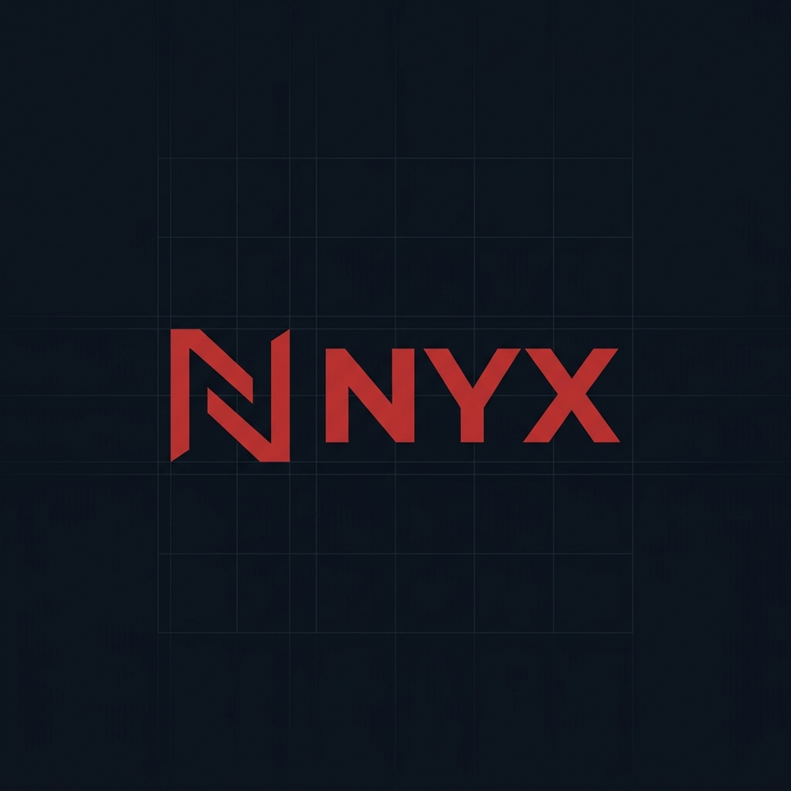

<div align="center">
  
  <br/><br/>
  
  <h3>nyxCore · v1.0.0 beta</h3>
  <p>Self-hosted server stack. Runs on Android (Termux/Proot-Distro).</p>
  <p><b>Unified Multi-Account Engine — Multi-Agent Multi-Model Router via Single API Gateway & Multi-Account Cloud Bridge</b></p>
</div>

---

## Overview

Nyx is a personal server system built to run on a Redmi Note 10S. It handles API routing, local model inference, cloud storage, OSINT queries, system monitoring, and a web dashboard — all containerized and self-managed.

Three components, one system:

| Name | Role |
|---|---|
| **nyxCore** | Orchestration layer — docker-compose, secrets, deployment |
| **nyxAgent** | API gateway & router — handles provider failover and local inference |
| **nyxUi** | Web dashboard — service management and system metrics |

---

## Stack

- **Runtime**: Podman / Docker on Debian (Termux proot)
- **API Layer**: FastAPI (Python)
- **Dashboard**: SvelteKit
- **Reverse Proxy**: Nginx + Cloudflare Tunnel
- **Local Inference**: Qwen2.5 via llama.cpp
- **Storage**: rclone (GDrive, MEGA, Dropbox, Terabox)
- **Monitoring**: Custom SSE metrics + Telegram alerts

---

## Setup

```bash
# 1. Copy environment template
cp core/.env.template core/.env

# 2. Edit credentials
nano core/.env

# 3. Run setup (downloads model, configures rclone, builds images)
bash core/setup-core.sh
```

---

## Configuration

**Multiple API keys** — separate with commas in `.env`:
```
GEMINI_API_KEYS=key1,key2,key3
```
nyxAgent round-robins automatically.

**CPU Isolation** — edit `cpuset` in `core/docker-compose.yml` to match your device's core topology.

**Cloudflare Tunnel** — set `PUBLIC_HOSTNAME` in `.env` after running `cloudflared tunnel login`.

**Telegram Alerts** — requires `TELEGRAM_BOT_TOKEN` and `TELEGRAM_CHAT_ID`.

---

## Under the Hood

**Target Hardware Topology** — Optimized for ARM64 architectures (specifically MediaTek Helio G95 / 2x Cortex-A76 & 6x Cortex-A55). Built with custom direct-power configurations (BMS bypass) to ensure safety and thermal stability during 24/7 continuous uptime.

**Compute Resource Freezing (Cgroups)** — The core incorporates a background watchdog that triggers `docker pause` on heavy inference containers (like `qwen-local`) after 30 minutes of idle time, instantly dropping CPU usage to 0% and freezing memory blocks until the next Nginx request wakes it up.

**Failover Routing & Token Budgeting** — The routing layer checks `rpm_free` and `tpm_free` dynamically. If an API key encounters an HTTP 429 error, it performs a seamless transparent failover to alternative provider tiers or falls back to local edge inference.

---

## Architecture

See `docs/flow.html` for the full system flow diagram.

---

## About

**Muhammad Saifulloh** — aka [renagge39](https://github.com/renagge39)

> "Build it small, run it everywhere, own everything."

*Inspired by [nanobot](https://github.com/renagge39/nanobot) and [CasaOS](https://www.casaos.io)*

<a href="https://linkedin.com/in/YOUR_LINKEDIN_HERE" title="LinkedIn — hardware demo">
  
</a>

---

<div align="center">
  <sub>v 1.0.0 beta — renagge39 2026</sub>
</div>
